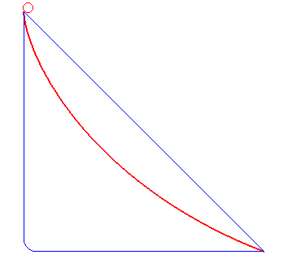

## 想到就去做

## 不是因为某件事很难，你才不想做，而是因为你不想做，让这件事变得很难。时间是否被充分利用，取决于我们做什么，时间管理的关键，就是对待重要的事，像对待坏掉的热水器一样

## 积累+努力：今天的成就是昨天的积累，明天的成功则有赖于今天的努力

## 内心没有方向的人，去哪里都是逃离

## 人活着是为了体验那些你没有体验过的美好

## 生活进入良性循环的唯一方法是自律。以及专注，2080法则

## 之所以迷茫，只是你的才华撑不起你的梦想，你的行动赶不上你的承诺

## 智商是衡量一个人思考问题的能力，情商是衡量一个人控制情感的能力，财商是衡量一个人控制金钱的能力

## 定期复盘

## 最重要的时间管理：80%的精力放在20%最重要的事情上

**只有20%重要的事情，会决定80%的结果**

## 选择是一件比聪明更难的事

选择大于努力，就是指的是首先要确定方向问题（选择），再确定方法问题（怎样努力）

## 发现错误，及时止损

**通过试错的方法来寻找方向，并不是一种十分科学的方法，并且成本和代价都极其高昂。**

## **最快的学习方法是：找到行业里的优秀人物带你。如何让他带你？最有效的方式就是证明自己的价值，或者支付费用买他的时间**

## 比能力重要1000倍的，是提升你的认知层次

1. 对职业目标的认知差距

   目标对人生有巨大的导向性作用

2. 对机会的认知差距

   **1、多关注时事新闻，少关注娱乐新闻**

   **2、看看身边快速崛起的朋友，了解他们在做什么**

   **3、多关注国内投资的方向（在36氪、虎嗅都能了解到）**

   **4、和优秀的人成为朋友，即便他不能带你，你也能学到很多东西**

3. 对工作本质的认知差距

   **真正能让你进步的，不是工作，加班，简单重复的执行工作，而是不断提升自己的认知和技能，掌握合理的工作方法，更高效地完成工作，从而有时间站在更高的层次去思考，创造出更高的价值。**

4. 对行业的认知差距

   **保持终身学习，跟随行业成长**

5. 对圈子的认知差距

6. 关于职业天花板

   **如果你的收入来源只有一个，当篮子摔在地上的时候，几乎就是斩断了收入来源。**

 ## 必备能力

1. 懂得与生人交谈
2. 能够处理人际关系问题
3. 适应新的生活环境
4. 应付各种压力
5. 自我管理
6. 为家庭运转做出贡献：学会照顾自己的需要，尊重别人和他们的劳动成果，学会礼貌，为整体利益承担自己的责任
7. 有能力挣钱和打理财务
8. 能够评估和承担风险

## 成为废柴的九大根源

1. 犹豫不决
2. 拖延
3. 三分钟热度
4. 害怕拒绝
5. 逃避现实
6. 自我设限
7. 总找借口
8. 恐惧
9. 拒绝学习

## 最速曲线

看图说话，图片很形象地给了答案。大伙是不是也感到意外呢？经过无数学霸的论证和科学实验，上图红色路线是最快的路线，此曲线也因此被称为“最速曲线”。话说这曲线有什么用呢？一个最简单的例子：如果你是一个滑雪运动员，目标是最短时间冲线，你根本就不在乎两点间的最短路径，而是最快路径。如果你沿着最佳曲线下滑，你会获得更多的优势……
 隐隐中总觉得它和我们的业务、事业、人生息息相关，似乎暗藏某种启示：
 **1.****顺势借力　开拓创新**
 从起点到终点，有无数条道路，直线与折线是大多数人会选择的路线。开拓思维，创造性地选择曲线路线，正确的选择是成功的一半。
 从起点到终点，小球能够滚动，在于其不安现状的同时能够顺势而行，借力地心引力才能让自己不断向前。
 同样，在我们的业务、事业、人生中，都需要不断的创新开拓，创新思路、方法，开拓市场、视野，借力顾客伙伴、数码科技。
 **2.****不忘初衷　方得始终**
 从起点到终点，小球一直看着终点的目标，自始至终都是朝着自己的目标前行，即使途中有短暂地偏离方向也不放弃自己所追求的终点，而恰恰是这种坚持与执着成就了最快抵达目的地的捷径。
 尼采曾说：一切美好的事物都是曲折地接近自己的目标，一切笔直都是骗人的。业务有障碍，事业有起伏，人生有曲折，无论何时何地，我们都要不忘初衷。只有不忘记自己最初的想法，才会找对人生的方向，才会坚定我们的追求，才能有始有终地去完成自己的梦想。
 **3.****现在行动　为时未晚**
 很多时候，我们会感慨，会抱怨，甚至会恨自己生不逢时。“怎么就没赶上市场好做的时候开始我的事业呢？”“现在才开始做市场，已经晚了。”

**最速曲线-两点之间最快的路线竟然不是直线。**
 我们要确保自己在“最速曲线”上。业务上，我们要用为市场检验过的最佳的业务开展方法；事业上，我们要确保自己在一个最佳的平台上投入一个能最快到达我们目标的事业中去；人生中，我们要时刻思利及人，践行健康、家庭、事业的三平衡，时间、财富、精神的三富足以及个人、集体、社会的三和谐。
 无论处于什么位置，只要选对了方法，站对了平台，用对了理念，那么，现在就行动吧，一切都为时未晚！
 两点之间最快的路线竟然不是直线，伙伴们，起点与目标之间最快的路线其实是你的选择与努力。