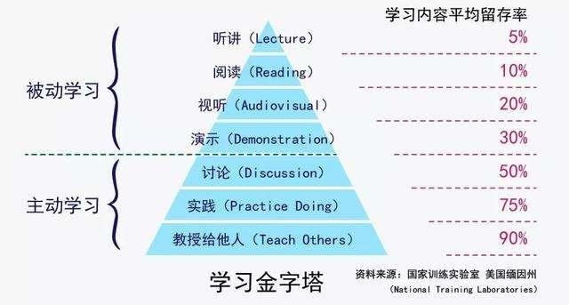

# 如何阅读一本书

知识分为显性知识和隐性知识。

隐性知识是被我们透彻理解后，只可意会不可言传的知识。

## 四种阅读目的

1. 你知道自己已经掌握的知识，阅读就是一种重温
2. 你知道自己还没掌握的知识，阅读就是一种学习
3. 你不知道自己已经掌握的知识，阅读就是一种启发
4. 你不知道自己应该掌握的知识，阅读就是一种收获

## 阅读方法：三二一一法则

三：三个问题。针对本书已有却尚未完全了解的观点，提出三个问题（一般是what，how，why），然后在书里或者书外寻找答案，批判阅读，回答问题，得出结论。

二：找出两个能够说明文章观点的具体案例。一个是书中已有的例子，另一个是自己切身经验相关的例子。

一：总结，记录。

一：行动。用具体的行动把它内化成自己能力的一部分，通过运用加深对知识的理解。

