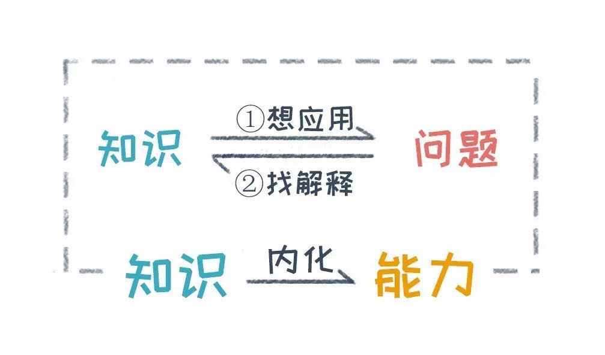

# 圈外商学院

## 一个模型，帮你找到真正热爱的工作

因为我们对自己的事业有期许，但当下的工作可能无法承载这样的期许，所以会觉得不喜欢，很迷茫。

冰山模型，全面描述了一个人的个体素质要素

## 四大要素，决定你的市场价值

* 知识 单纯用知识能难赚钱
* 技能 在稀缺的时候很值钱，人才供给增多，市场价值就会下降
* 能力 能力提升是可以跨行业跨职业的，积累到一定高度，哪怕行业不行，换个地方一样值钱
* 自我发现 

长期来说，提升自己的市场价值，把大多数时间花在提升能力和认识自己的冰山底层要素上，是最好的选择。但事实上，大多数人是怎么做的呢？每天打开各种学习产品，不断学习各种碎片化知识，练习一些并不稀缺的技能，考几个月就能拿下来的证，最后收入还是上不去，反而觉得很挫败。

为什么我们会做出这样的选择呢？

1. 知识和技能的学习最容易。而能力需要持续投入，刻意练习。人们总是倾向于做容易的事情，而不是正确的事情。
2. 受限于目前岗位的定位。
3. 没有看清楚工作的本质。任何工作都是在解决问题。一家公司也是在解决某类用户问题。

**我们的时间，永远应该花在正确的事情上，而不是容易的事情上**

## 发现隐藏能力

## 三种方法，将知识内化成能力

1. 掌握20%的核心 一个领域20%的核心内容，可以解决这个领域80%的问题
2. 知识和问题互相靠
   * 知识向问题靠：思考这个知识能解决什么问题
   * 问题向知识靠：遇到问题的时候，抛弃第一反应，不要先按照自己的思维定式解决，去想有什么方法论模型可以用
3. 系统化训练，刻意练习

**我们的习惯，是高估几天的变化，而低估几个月的变化**

## 三大系统，让学习不靠意志力

人的意志力是有限的，任何让自己坚持的事情，都会消耗它，从而让你感觉非常累。比如你会发现，如果我们一段时间工作压力很大，就会更容易放弃健身等好习惯，因为我们意志力在坚持工作这方面已经耗费光了，所以没有多余意志力用在坚持健身上了。

学习也一样，当你坚持学习的时候，不是学习这件事累着你，而是坚持这件事累着你了，因为意志力会耗费大量能量。

能够让我们坚持做一件事情，比如学习，并不是只靠意志力的。其实有3个关键因素：

* 理性上知道学习
* 情感上愿意去学习
* 情境上制造适合学习的场景

坚持做成一些事情，而不是白天堕落，晚上后悔然后发誓，然后第二天继续这个堕落、后悔、发誓的循环。

1. 发挥理性的作用，树立明确目标，是坚持学习的第一步

2. 发挥感性的作用，利用情绪冲动

   1. 截止日期的紧迫感
   2. 比较产生的焦虑感
   3. 鼓励带来的成就感

3. 发挥情境的作用，创造学习环境。**如果可以用环境，就不要用意志力抵制欲望**

   如果让你不看电视，最好的方法是别买电视；如果想让你少刷朋友圈，最好的方法是把小红点关掉，甚至把朋友圈关掉。

## 三个建议，让你不做定制化人才

1. 调整主体，给自己定好发展方向
2. 提升能力，让自己成为可迁移的人才
3. 提升认知高度，让自己成为纵向可扩展的人才

